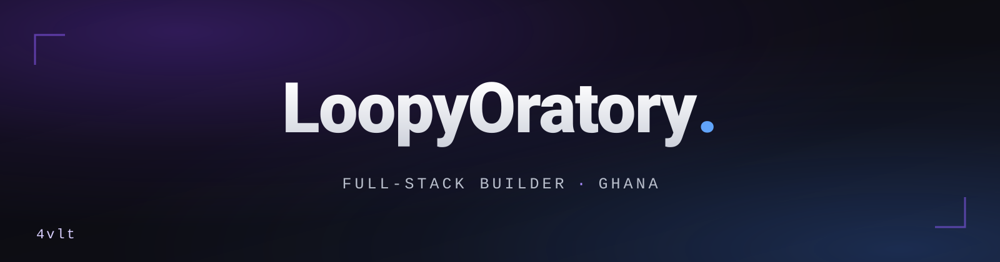

  

  

## about

Ghana-based full-stack builder. I design, build and ship complete products solo: web apps, storefronts, and the payments and messaging layers underneath them. Everything runs on Bun and TypeScript end to end, deployed with Docker on infrastructure I run myself.

Most of my work is aimed at how people actually use the internet here: mobile-first, WhatsApp-first, with mobile money as a first-class payment method.

## stack

**core**

  

**frontend**

    

**backend and data**

      

**infra**

   

**ai**

     

**quality and media**

  

## selected work

<table>
  <tr>
    <td width="50%" valign="top">
      <b><a href="https://github.com/LoopyOratory/BunWa">BunWa</a></b> 
      WhatsApp HTTP API server on Bun: WAHA-compatible, the same API surface at a fraction of the resource cost. 
      Bun · Hono
    </td>
    <td width="50%" valign="top">
      <b><a href="https://github.com/LoopyOratory/whatsapp-business-kit">WhatsApp Business Kit</a></b> 
      Agency-in-a-box for Ghanaian SMEs: catalog, orders, payments and broadcasts on WhatsApp. 
      WhatsApp Business API
    </td>
  </tr>
  <tr>
    <td width="50%" valign="top">
      <b><a href="https://github.com/LoopyOratory/openwa-mcp">OpenWA MCP</a></b> 
      A Model Context Protocol server that gives AI agents a WhatsApp interface. 
      MCP · WhatsApp
    </td>
    <td width="50%" valign="top">
      <b><a href="https://github.com/LoopyOratory/bun-telegram-download-bot">Telegram Download Bot</a></b> 
      A fast Telegram media downloader built on Bun, powered by yt&#8209;dlp. 
      Bun · grammY · yt&#8209;dlp
    </td>
  </tr>
</table>

## currently building

Products in flight, built for Ghana first:

- **resume.4vlt**: resume builder with grounded AI tailoring that cannot invent facts. 45 templates, ATS scoring.
- **qr-code.4vlt**: QR platform for menus, files and dynamic codes. Scan analytics, bulk generation, API access.
- **sports.4vlt**: sports odds and accumulator tracker on live data.
- **movies.4vlt**: streaming front end for movies and series.
- **Vivita**: multi-vendor marketplace on Medusa v2, with Paystack and mobile money checkout built in.

## stats

  
  

  

